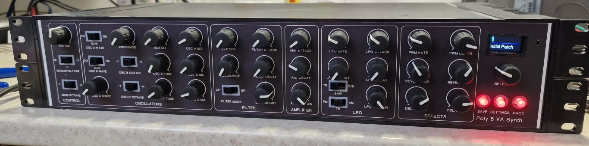

Teensy-Poly6

This is a polyphonic synth forked from albnys/TeensyPoly6 converted into a 2U 19" rack.

I have tidied up the files so it now compiles properly

The analogue interface now uses 6 MUX chips to read the pots and switches so there is no need to connect top the top or underneath of the Teensy 3.6 for the extra analogue inputs required. It runs smoother now as well.

The schematics are upto date now with the latest mux changes.

The synth is built using a teensy 3.6 overclocked to 192Mhz and is programmed in Arduino IDE using the teensy audio library.

Easily upgrade to a T4.1 or even a T4.0 as very few connections are required now. Increase of polyphony is probably available with a T4.x.

How it sounds in the original keyboard form, this sound engine is unchanged.

https://www.youtube.com/watch?v=Exk_K2VwGu0
